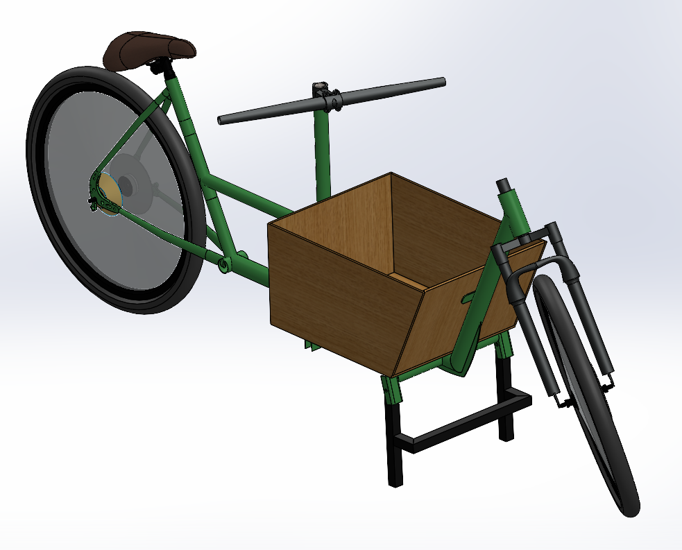
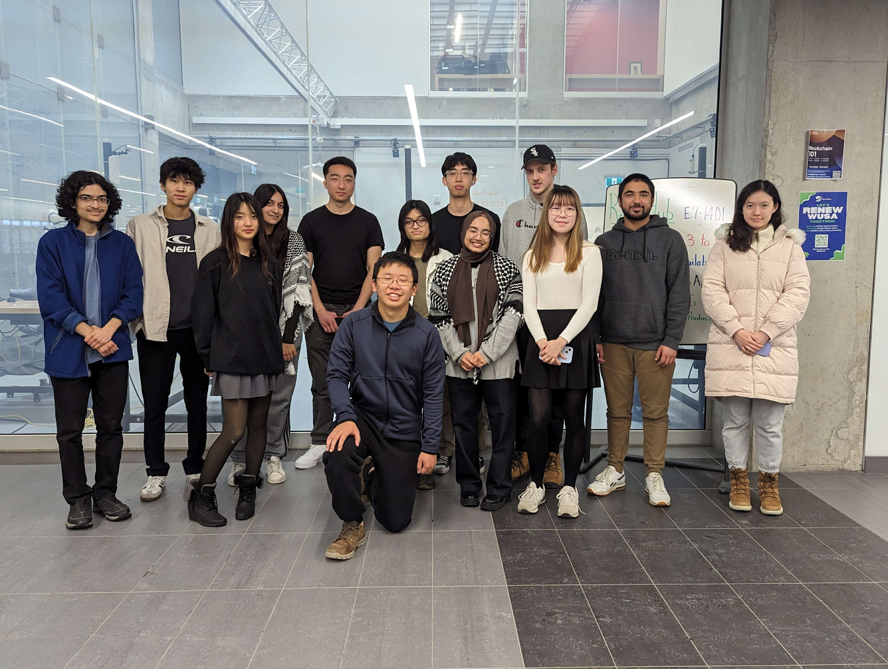

# Bakfiets

### Project Info

| **Term:** | Winter 2025 |
| -------------------- | --------------------------------------------------------------------------|
| **Team Lead:**       | Jerry Chen |
| **Mecahnical Lead:** | Jerry Chen |
| **Firmware Lead:** | Patrick He |
| **Electrical Lead:** | Samuel Ke |
| **Mechanical Team:** | Jerry Chen, Kevin Ng, Aidan Thompson, Aiyesha Shibly, Samual Wong, Allen Lu |
| **Firmware Team:** | Patrick He, Kimberley Hoang, Alisa Wu, Aman Zaveri |
| **Electrical Team:** | Jacob Wielowieyski, Alex Liu, Samuel Ke, Suhyma Rahman |

### Project Description

Bakfiets is a front-loading cargo bike style popular in the Netherlands for carrying groceries or bringing kids to school. Our Bakfiets, “Bak Choy”, is an electrically-assisted bakfiets with a custom-built frame, 48V electrical system, dynamic lighting, and display interface.

### What We Do
- Custom Frame: Tailor-made 4130 chromoly frame designed using SolidWorks Weldments, featuring two 26” wheels, disc brakes, and suspension fork.
- Welding Jig: The rear triangle is welded using our standard adjustable aluminum extrusion bike jig, while the main frame is welded using a single-use laser cut MDF jig.
- Steering System: The steering is connected to the front fork via a linkage system using an adjustable-length steel tube with ball joints on either end. Steering linkage was optimized to provide a natural turning rate and to clear other components. A solid linkage was chosen over a cable driven system due to the increased simplicity and reliability.
- Kickstand: Heavy-duty spring-loaded mild steel kickstand with lowered middle to provide clearance for the steering linkage.
- 48V Electrical System: The bike features a 48V 12S3P 18650 quick-release battery pack, 500W hub motor, and a 48V/5V power distribution board to power the undermounted LED strip and microcontroller. We also attempted to design our own anti sparks to protect the battery.
- VESC Motor Controller: The bike uses an open-source FSESC6.7 VESC-based motor controller to run the motor and interface with the microcontroller.
- Display Interface: The bike features an OLED display powered by an ESP32 S3 Pico, which displays information like speed, battery, and power level. The microcontroller also runs the LED strip via the FastLED library, allowing for a variety of patterns, as well as segmented turn signal indication. 

### Our Goal

**Our goals are to improve our mechanical, electrical, and firmware abilities:**\
For many of us, it was our first time using SolidWorks weldments, designing electronics enclosures, and creating welding jigs. As well, we learned machining, notching tubing, and woodworking. The power distribution board and anti sparks were some of our first custom PCBs, and members learned how to solder XT30/60 connectors and SMD components. Members learned how to control VESC and program microcontrollers to respond to user inputs.