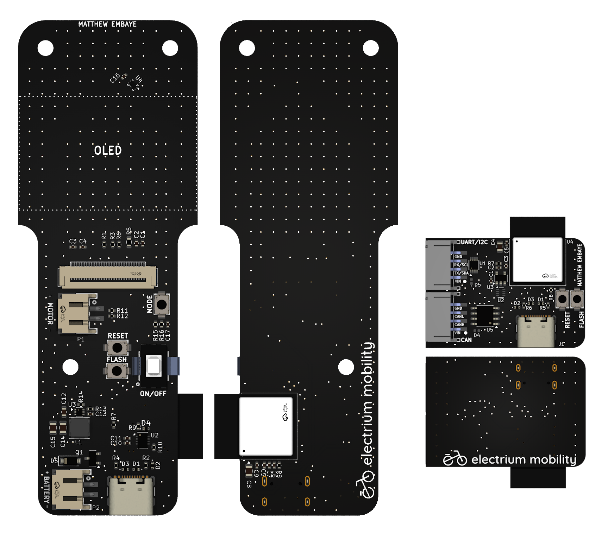

# Custom Remote Control

### Project Info

| **Term:** | Winter 2025 |
| -------------------- | --------------------------------------------------------------------------|
| **Project Lead:**       | Matthew Embaye |
| **Firmware Lead:** | Harman Shienh |
| **Electrical Lead:** | Matthew Embaye |
| **Mechanical Team:** | Justin Zhang, Christopher Noce, Ole Ashadele |
| **Firmware Team:** | Harman Shienh, Andrew Jia, Max Ghislain, Ayan Hazarika, Vincent Qu, Abdul (Hakeem) Farooqi, Caleb Mengistu, Sehaj Dhupia |
| **Electrical Team:** | Matthew Embaye, Jun Kim, Nelson Mei, Katie Yu, Nina Zhang, David Xu |

### Project Description
The Remote Control project is a custom, adaptable, and upgraded controller designed to work with all current and future Electrium Mobility projects. Tailored for seamless communication and enhanced functionality, the W25 Custom RC is one of Electrium Mobility’s most versatile and valuable projects. Featuring a custom PCB with Bluetooth, OLED display, and haptic feedback, with the receiver also including CAN support for VESC communication, the Custom RC is highly comprehensive in both its design and features. 

###  What We Do

#### 🛠️ Custom Circuit Board
- Designed with **KiCad**, the **PCB** is built from the ground up.  
- **Schematic capture → PCB layout → Component soldering** ensures performance & reliability.  

#### 📡 Firmware Development
- Built around the **ESP32-C6**, our **firmware** supports **Bluetooth communication**.  
- Enables **seamless interaction** between the **remote control** and the device.  
- **OLED display** and **haptic vibration feedback** provide **real-time feedback** on:
  - 🟢 **Battery health**  
  - 🟢 **Current speed**  
  - 🟢 **Adjustable settings**  
- **Advanced features**: Power-saving modes, Customizable control options, **CANBUS for VESC** integration.

#### 🏗️ Prototyping & Testing
- Built prototypes and pushed **firmware updates** for fine-tuning.  
- Conducted **extensive debugging, hardware adjustments, and firmware testing**.  
- Ensured **optimal performance** across multiple devices and settings.

#### 🎨 User Interface Optimization
- Focused on **refining the user interface** displayed on the **OLED screen**.  
- Prioritized **clear, easy-to-read information** and **intuitive navigation**.  
- Ensured the **remote is both functional and user-friendly**.

### Our Goal
Our primary goal is to improve the electrical and firmware abilities of our team. For many, it was the first time ever using KiCad, circuit design, and learning the schematic capture and design process. Additionally, we learned soldering, component selection, and footprint design. The team learned about CANBUS and Bluetooth interfacing, as well as how to develop firmware for the remote’s full functionality. This included controlling VESC, programming microcontrollers to respond to user inputs, and managing the OLED display. 
