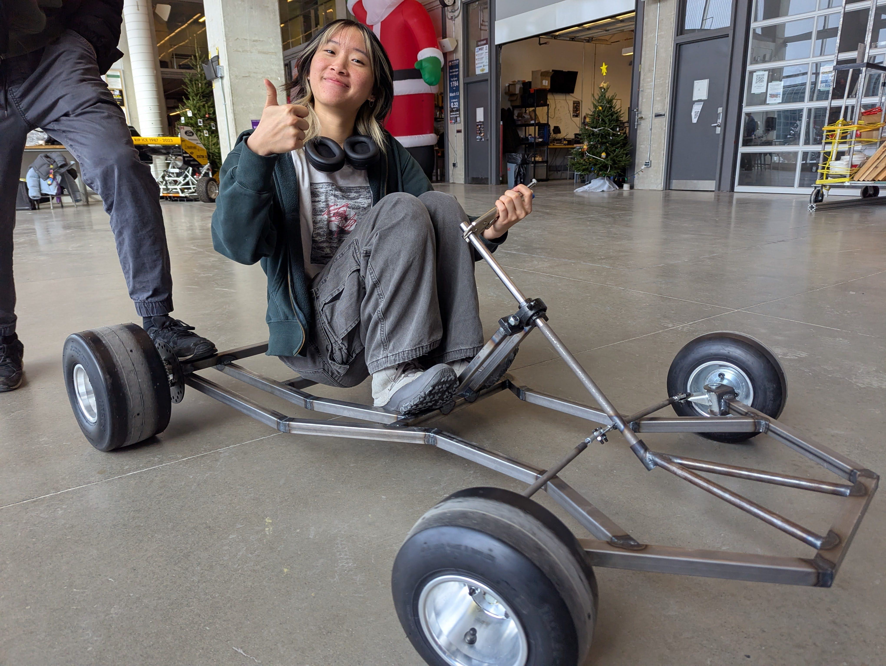
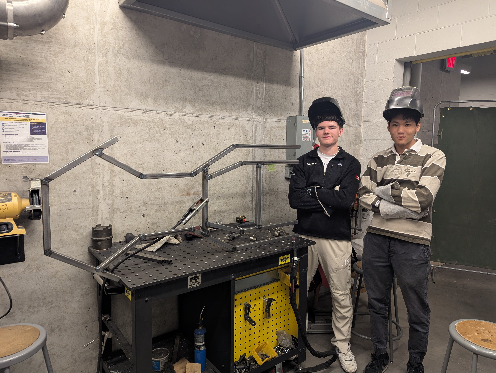
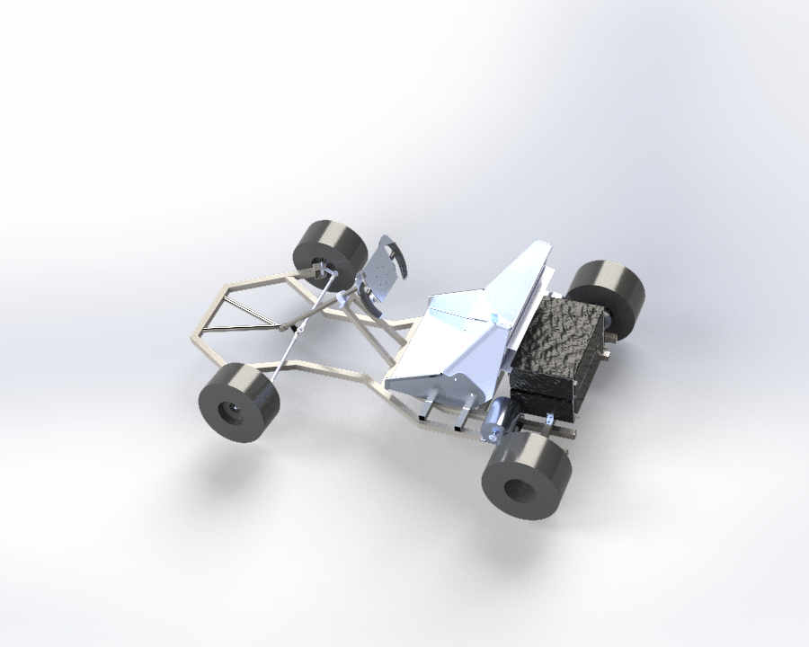

# Gokart

### Project Info

| **Term:** | Winter 2025 |
| -------------------- | --------------------------------------------------------------------------|
| **Project Lead:**       | Josh Stadnyk |
| **Mechanical Team:** | Ethan Guan, Ivan Lin, Ling-Wei Tang, Grace Pan, Lina, Alena Wang, Mia, Jerry Chen |
| **Firmware Team:** | James, Ally, Jonathan Shanmuganantham, Elin |
| **Electrical Team:** | Emmanuel, Brain Zhang, Andrew Chai |

### Our Goal
We are building Electriums first electric Go-Kart! This project is unique because we are working with two independent electric motors. This allows our team to tackle an array of complexities both mechanically and electronically to expand our knowledge in these respective fields. Currently, the team is making swift progress in getting the car to a driving state, and we hope to hit the road by the end of the term!
 

### 🔧 Key Features

#### ⚙️ Mechanical Systems
- Almost everything has been **designed and manufactured** by the team.  
- **Current Progress:**  
  - ✅ **Chassis complete**  
  - ✅ **Wheel hubs completed**  
  - 🚧 **Ongoing tasks:** brake & pedal mounts, steering wheel, chair, battery box  
- 🎨 Seeking **ideas for the car color**—come to our meetings to share your suggestions!  

---

#### ⚡ Electrical Systems
- **Motors:** Each motor runs on **2000W and 48V**—requiring a lot of power!  
- **Current Work:**  
  - 🛠️ **BMS purchase & implementation** with motors and **electronic speed controllers (ESC)**  
  - 🔄 **Voltage control:** Two **buck converters** (48V → 12V & 12V → 5V) for power management  
- 🏭 A **great hands-on opportunity** for team members interested in **manufacturing hardware**!

---

#### 🖥️ Firmware Systems
- The **firmware team** is working with **ESP32 microcontrollers**.  
- **Main focus:**  
  - 📟 **Connecting an OLED display** on the **steering wheel**  
  - 🔄 Displaying **real-time battery & motor data from the BMS**  

---
