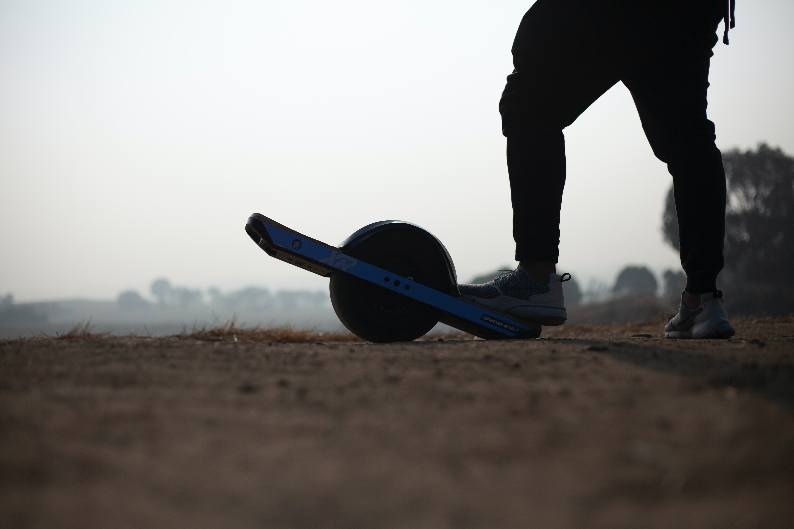

# OneWheel

### Project Info

| **Term:** | Winter 2025 |
| -------------------- | --------------------------------------------------------------------------|
| **Project Lead:**       | Zachary Barandino |
| **Electrical Team:**       | Liam Ung, Andre Ke, Daniel Roufail |
| **Firmware Team:** | Allan, Nathan Li, Nur Iscan, Weiran Sun |
| **Mechanical Team:** | Alice Lee, Spencer Dionisio, Omer Syed, Eric Mak, Zach Gilbert |

### Project Description

A Onewheel is a self-balancing electric skateboard with a single large wheel in the center, using sensors and gyroscopes to maintain stability. Riders control speed and direction by leaning forward or backward, making it feel like a mix of snowboarding and surfing on land. Our Onewheel is built off a custom-made frame, 60V electrical system, and dynamic underglow lighting.

### Our Goal
We aim to improve our technical knowledge in firmware, electrical, and mechanical design. 
Many of us gained experience using SolidWorks weldments, creating electrical schematics, and configuring PID control on our VESC. We learned about Battery Management Systems to support our custom 16s2p battery pack, as well as woodworking and machining the various structural components for the frame.

