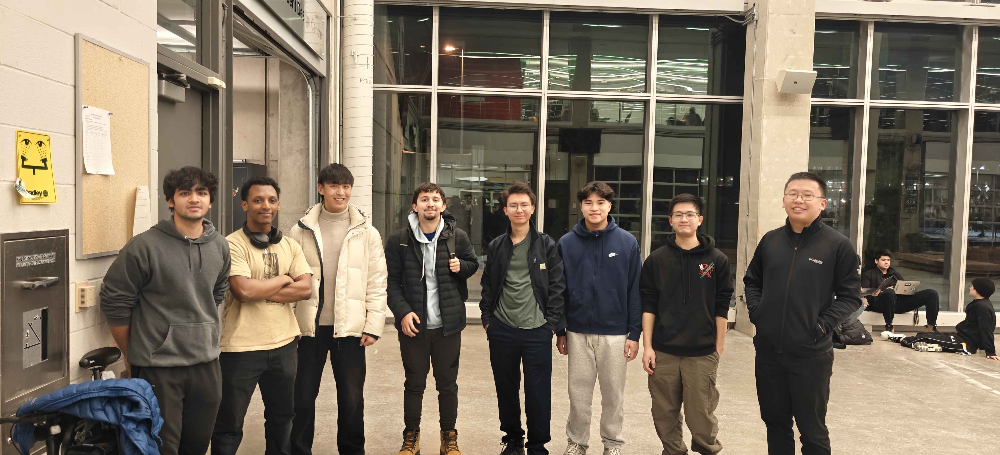
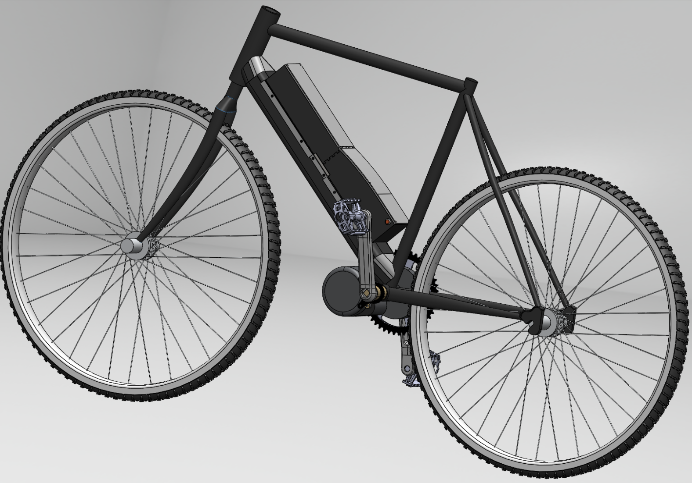

# Road Bike

### Project Info

| **Term:** | Winter 2025 |
| -------------------- | --------------------------------------------------------------------------|
| **Project Lead:**       | Henon Hailu |
| **Mechanical Team:** | Jason, David, Miles Shum, Zora Yang, Dennis, Alan, Gary, Ethan, Clea Blais |
| **Firmware Team:** | Ryan, Alex, Kay |
| **Electrical Team:** | Lucas, Arman, Krishna |

### Our Goal
We're building a long-range road e-bike to give our members hands-on engineering experience by designing a personal mobility vehicle from the ground up! Our goal? Ride to London, ON, on a full charge!

Through this project, our team gained experience in mechanical design, FEA, manufacturing, firmware, and PCB design, all while pushing innovation and making mobility more accessible.

### Key Features

#### 🛠 Custom Frame
The bike is built on a **25CrMo4 chromoly frame**, designed for durability and performance.  
This is one of our first frames that were built from scratch (**Cut, Notched, and Welded**)!  
Members researched road bike geometry, translated it into precise **CAD models**, selected tubing, and created a full assembly while maintaining proper geometry.

Additionally, the bike features a **custom-bent 4130 steel sheet downtube**, shaped to house our **modular battery pack** while integrating a **secure locking mechanism**.  
This ensures structural integrity while keeping a sleek, aerodynamic design.

---

#### ⚡ Electrical System (10S6P, 36V, 20A)
Powered by a **36V modular battery pack** and a **500W mid-drive motor**, our bike strikes a balance between **energy density and discharge capability** for optimal long-range performance.  

In addition, a **custom anti-spark system** was developed and will be tested to integrate into the system.

---

#### 🖥️ Custom Bike Computer
The bike features an **onboard computer** that tracks **speed, distance, and GPS data**, displaying real-time metrics on a **high-contrast LCD screen** for easy readability in various lighting conditions.  

Riders can interact with the system through a **compact, custom-designed PCB**, enclosed in a **3D-printed casing**, ensuring durability and a streamlined user experience.

---

